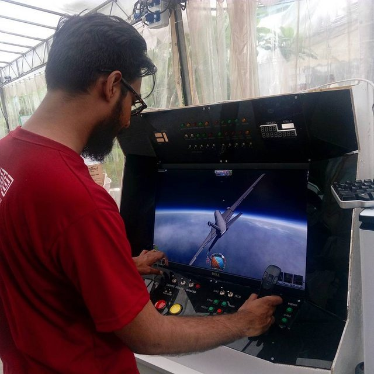
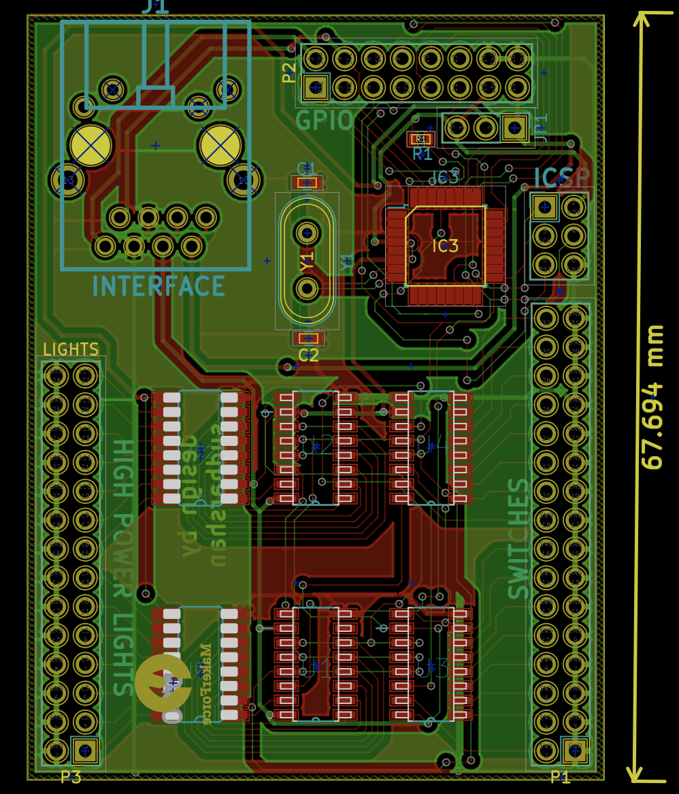
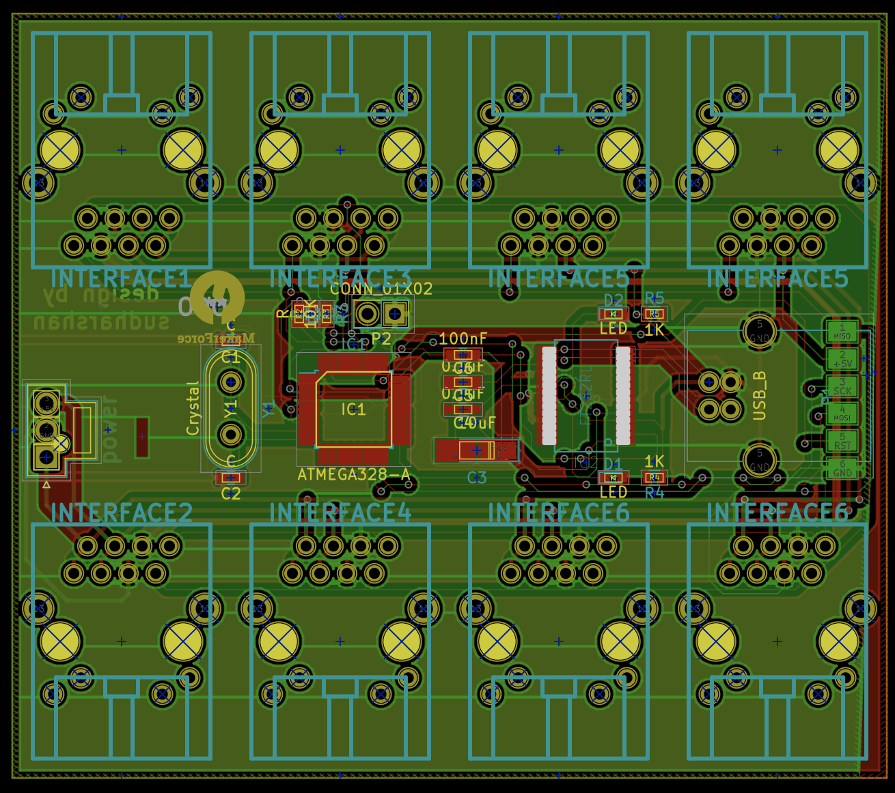

# KerbalKontrol
Kerbal Space Program is a popular space simulator game which we at MakerForce been enjoying for a while. So, we decided
to just go build an arcade like console for it. This project was fortunate enough to be featured on [Hackaday](), and you
can check out the original blog post [here](https://makerforce.io/the-ksp-command-station-2/).



# Implementation
This control station is based fully upon the ATMEGA328 as its primary MCU. It is powered by 2 custom designed PCBs - the IO-Board and the Main-Board. The IO-Board is connected to each panel and contains a single MCU + shift registers. All of the IO-Boards are wired to the Main-Board using RJ45 conns and ethernet cables. The communication bus within is currently I2C but we want to switch to D-I2C in the future. All of the IO-Boards are configured as I2C Slaves and the Main-Board is the single master.



The internal switches, lights are wired up to the boards through the header connectors visible on the IO-Board.



# Software
Everything is programmed using avr-libc with no external libraries. 

## Compile from source
To compile from source for the IO-Board and Main-Board, follow the steps below.

```
git clone https://www.github.com/solderneer/KerbalKontrol
cd code/io-board
make
```

```
git clone https://www.github.com/solderneer/KerbalKontrol
cd code/main-board
make
```
The directory can simply be cleaned with this command.

```
make clean
```
